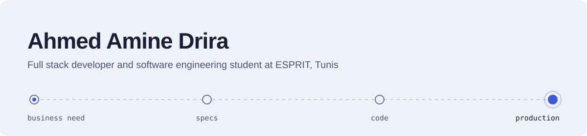
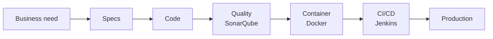

<picture>
  <source media="(prefers-color-scheme: dark)" srcset="./assets/header-dark.svg">
  
</picture>

Final-year software engineering student at **ESPRIT** in Tunis. I build full stack applications for web, mobile and desktop, and I take them all the way to deployment with Docker and CI/CD. Four internships taught me to start from the business need, not from the framework.

> [!NOTE]
> **Looking for a final-year internship (PFE) starting January 2027.** Full stack development first, and open to AI, cloud or security topics.
> Reach me on [LinkedIn](https://www.linkedin.com/in/ahmed-amine-drira/) or at [ahmed.a.drira@gmail.com](mailto:ahmed.a.drira@gmail.com).

## Selected work

<!-- Replace each REPO_NAME with the real repository name. Remove a row if the repo is private. -->

| Project | What it does | Stack |
|---|---|---|
| [**Network access platform**](https://github.com/AhmeDrira/poulina-internet-access-management) Internship, Poulina Group Holding, 2026 | Digitizes internet and network access requests: validation workflow, SSO login and built-in AI assistance | NestJS, React, OAuth 2.0 / SSO |
| [**BMP**](https://github.com/AhmeDrira/PIDEVxBMP) Construction marketplace | Marketplace for a Tunisian construction company, mobile-first and installable as a PWA | MongoDB, Express, React, Node.js |
| [**Construction ML models**](https://github.com/AhmeDrira/REPO_NAME) Machine learning, built on top of BMP | Predicts project risk, estimates the optimal cost and recommends options, trained on business data | Python, scikit-learn, Pandas, CRISP-DM |
| [**ReportCraft**](https://github.com/AhmeDrira/REPO_NAME) Final-year project (bachelor), Wevioo, 2024 | Generates forms and reports dynamically from a configuration | React, Spring Boot |

## How I ship

AI coding agents are part of my daily workflow. I use them to move faster, and I stay responsible for every line that ships.

## Stack

| | Main | Also worked with |
|---|---|---|
| **Web** | React, NestJS, Spring Boot | Angular, Node.js / Express, Django, Laravel, Symfony |
| **Mobile & desktop** | React Native | Android, JavaFX, PWA |
| **AI** | LLM integration, prompt engineering | scikit-learn, Pandas |
| **DevOps** | Docker, Git / GitHub | Kubernetes, Jenkins, SonarQube |
| **Security** | OAuth 2.0 / SSO, JWT and refresh tokens | Role-based access control |
| **Data** | SQL, MongoDB | GraphQL |
| **Languages** | Java, TypeScript, Python | JavaScript, PHP |
